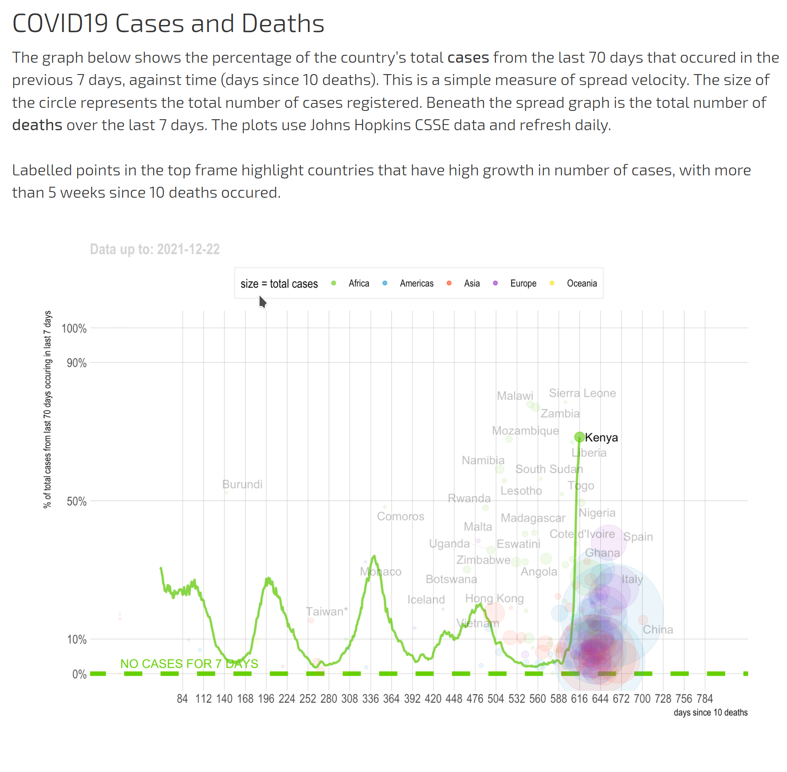

# A Scraper for COVID19, as reported by Country

The R scripts that generates the COVID19 plots hosted at [llvll.ch](https://llvll.ch).

# Source

Uses the collated data from Worldometers and Johns Hopkins 
